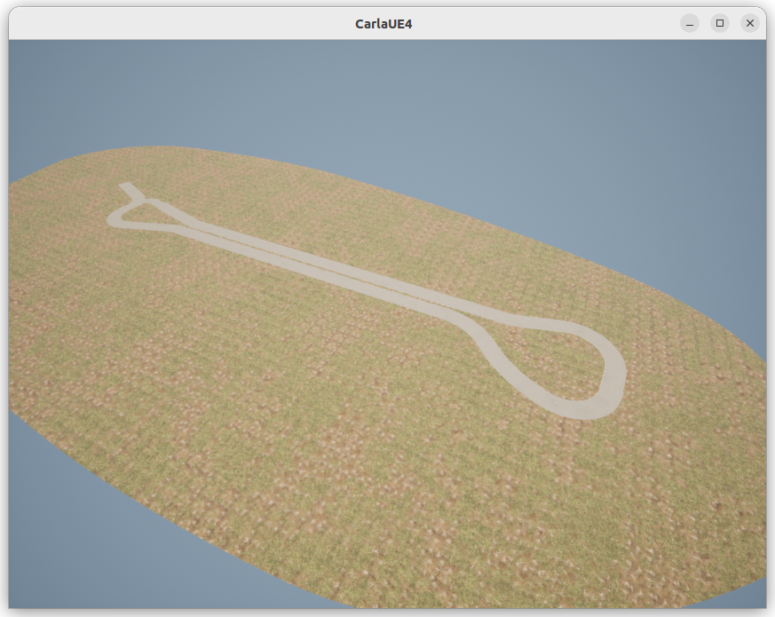
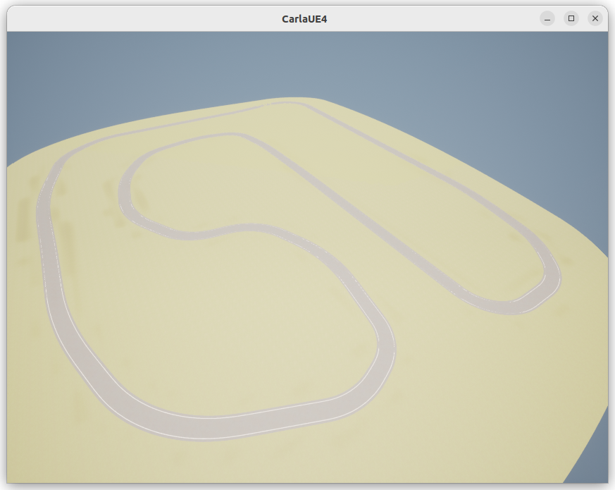

# CARLA_Custom_Maps
Some Custom Map for CARLA Simulator

## Used Version:
- 0.9.14

## Usage:
- Place "*.tar.gz" file to Import folder
- Run .ImportAssets.sh file to Import the map
- Start CARLA server
- Change map with "python PythonAPI/util/config.py -m 'MapName'"

## Maps:
- Example

- Example_2

